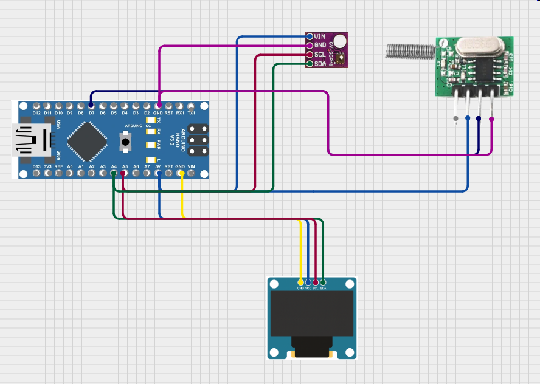

# WeatherSensor
Remote weather sensor project

Arduino Nano
BME280 5V I2C Temeperature Humidity Sensor with Atmospheric Barometric Pressure
433mhz Wireless RF Transmitter

Require Library
RadioHead
forcedBMX280
BMD31M090

